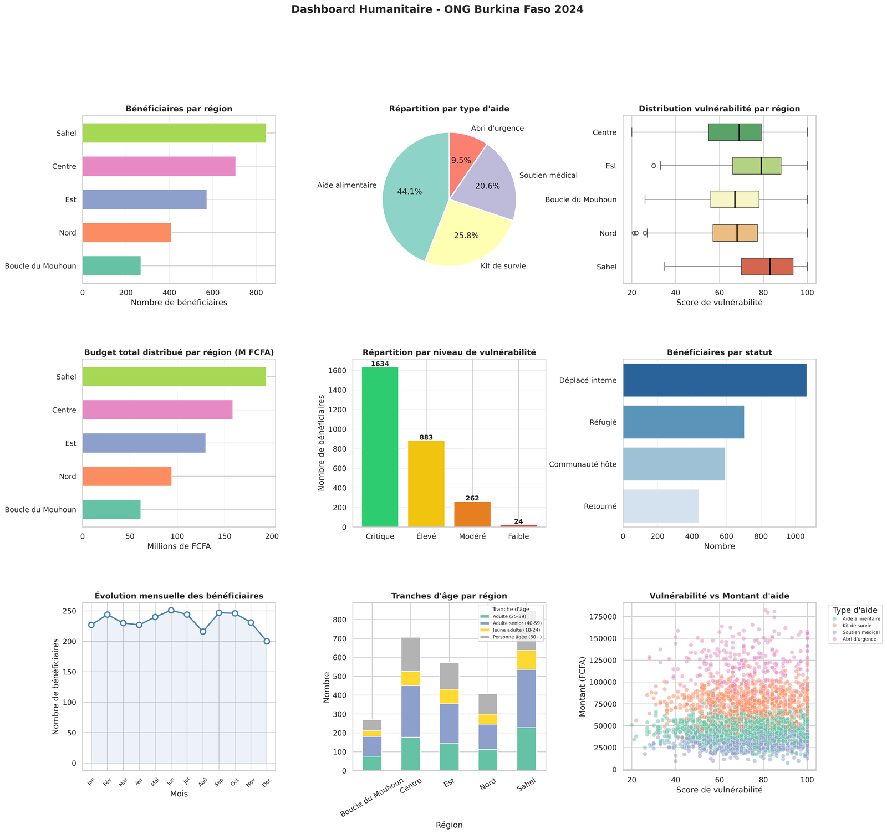

# Analyse Humanitaire : ONG Burkina Faso

Pipeline Python de nettoyage, segmentation et reporting appliqué à un jeu de données humanitaires fictif.


> ** Données entièrement fictives.** Le jeu de données est généré aléatoirement par le script lui-même (`numpy`, graine fixe = 42) à des fins pédagogiques. Aucun nom, aucune organisation et aucun chiffre ne correspond à une situation, un bénéficiaire ou une ONG réels.

## Sommaire

- [Contexte](#contexte)
- [Objectifs](#objectifs)
- [Structure du dépôt](#structure-du-dépôt)
- [Le jeu de données](#le-jeu-de-données)
- [Pipeline de traitement](#pipeline-de-traitement)
- [Score de vulnérabilité et priorité](#score-de-vulnérabilité-et-priorité)
- [Résultats et visualisations](#résultats-et-visualisations)
- [Installation et exécution](#installation-et-exécution)
- [Compétences techniques démontrées](#compétences-techniques-démontrées)
- [Limites connues et pistes d'amélioration](#limites-connues-et-pistes-damélioration)
- [Licence et auteur](#licence-et-auteur)

## Contexte

Une ONG internationale fictive intervient dans 5 régions du Burkina Faso (Centre, Sahel, Est, Nord, Boucle du Mouhoun), où elle distribue de l'aide alimentaire, des kits de survie, un soutien médical et des abris d'urgence à des bénéficiaires vulnérables (personnes déplacées internes, réfugiées, retournées, ou issues des communautés hôtes).

Ce projet se place du point de vue d'un·e data analyst intern chargé·e d'analyser l'ensemble des opérations menées en 2024 : diagnostiquer et nettoyer les données brutes, construire un score de vulnérabilité pour segmenter les bénéficiaires, analyser la répartition de l'aide, produire un dashboard, et en tirer des recommandations pour cibler les interventions futures.

## Objectifs

- Diagnostiquer et nettoyer un jeu de données réaliste (doublons, valeurs manquantes, valeurs aberrantes)
- Construire un score de vulnérabilité composite et en dériver un niveau de priorité d'intervention
- Analyser la distribution de l'aide par région, type d'aide, statut et période
- Produire un dashboard de visualisation complet
- Exporter les résultats vers Excel (multi-onglets) et CSV
- Formuler des insights et recommandations orientés décision

## Structure du dépôt

```
projet-ong-burkina-2024/
├── script_00.txt              # Script principal (pipeline complet, 8 étapes)
├── README.md
├── requirements.txt
├── ong_burkina_2024.csv       # Généré à l'exécution : dataset brut (avec anomalies)
├── ong_burkina_propre.csv     # Généré à l'exécution : dataset nettoyé + variables calculées
├── rapport_ong_2024.xlsx      # Généré à l'exécution : rapport Excel multi-onglets
└── dashboard_ong.png          # Généré à l'exécution : dashboard de visualisation
```

> Le script s'exécute actuellement depuis un répertoire fixe (`os.chdir`) et écrit tous les fichiers générés à la racine de ce répertoire. Voir [Installation et exécution](#installation-et-exécution) pour l'adapter à votre machine.

## Le jeu de données

### Champs bruts (`ong_burkina_2024.csv`) - 2 800 bénéficiaires (+ 40 doublons intentionnels)

| Colonne | Type | Description | Valeurs / plage |
|---|---|---|---|
| `id_beneficiaire` | int | Identifiant unique | 1 - 2800 |
| `nom` | str | Nom complet généré aléatoirement | - |
| `sexe` | str | Sexe | Masculin (48 %), Féminin (52 %) |
| `age` | int | Âge | 18-75 ans (+ valeurs aberrantes injectées) |
| `region` | str | Région d'intervention | Centre, Sahel, Est, Nord, Boucle du Mouhoun |
| `province` | str | Province rattachée à la région | 3 provinces par région |
| `statut` | str | Statut du bénéficiaire | Déplacé interne, Réfugié, Communauté hôte, Retourné |
| `taille_menage` | int | Taille du ménage | 1-11 personnes |
| `type_aide` | str | Type d'aide distribuée | Aide alimentaire, Kit de survie, Soutien médical, Abri d'urgence |
| `montant_fcfa` | float | Montant d'une distribution | ≈ 5 000–180 000 FCFA (loi normale, moyenne selon le type d'aide) |
| `nb_distributions` | int | Nombre de distributions reçues en 2024 | 1-7 |
| `score_vulnerabilite` | int | Score de vulnérabilité composite | 0-100 |
| `mois` | int | Mois de la distribution | 1-12 |

### Anomalies injectées volontairement

| Anomalie | Volume | Traitée à l'étape |
|---|---|---|
| Doublons exacts | 40 lignes | 3 - `drop_duplicates()` |
| Âges manquants | 60 valeurs | 3 - imputation par médiane |
| Provinces manquantes | 45 valeurs | 3 - imputation par `"Inconnue"` |
| Montants manquants | 30 valeurs | 3 - imputation par médiane |
| Âges aberrants (-5, 150, 200) | 15 valeurs | 3 - mis à `NaN` puis imputés |
| Montants négatifs (-1000) | 10 valeurs | 3 - remplacés par la médiane |

### Colonnes ajoutées après nettoyage (`ong_burkina_propre.csv`)

| Colonne | Description | Valeurs possibles |
|---|---|---|
| `tranche_age` | Tranche d'âge | Jeune adulte (18-24), Adulte (25-39), Adulte senior (40-59), Personne âgée (60+) |
| `categorie_menage` | Taille du ménage catégorisée | Petit (1-2), Moyen (3-5), Grand (6-8), Très grand (9+) |
| `niveau_vulnerabilite` | Niveau dérivé du score de vulnérabilité | Faible, Modéré, Élevé, Critique |
| `montant_total_recu` | Montant total perçu sur l'année | `montant_fcfa × nb_distributions` |
| `priorite` | Priorité d'intervention | Urgente, Haute, Normale, Faible |
| `saison` | Saison de la distribution | Saison des pluies (juin–sept.), Saison froide (déc.–fév.), Saison sèche (reste de l'année) |

## Pipeline de traitement

Le script s'exécute de façon linéaire en 8 étapes :

1. **Création du dataset** - génération synthétique de 2 800 bénéficiaires (`numpy`, graine = 42), anomalies volontaires incluses
2. **Diagnostic** - quantification des doublons, valeurs manquantes et valeurs aberrantes
3. **Nettoyage** - dédoublonnage, conversion de types (`pd.to_numeric`), imputation par médiane / catégorie, correction des valeurs aberrantes et négatives, standardisation des chaînes
4. **Colonnes calculées** - création des 6 variables dérivées listées ci-dessus
5. **Analyse et agrégations** - KPIs globaux, performance par région, performance par type d'aide
6. **Visualisations** - dashboard 3×3 (9 graphiques) avec `seaborn` / `matplotlib`
7. **Export** - CSV nettoyé et rapport Excel multi-onglets
8. **Insights** - génération automatique de 5 constats et recommandations

## Score de vulnérabilité et priorité

Le score de vulnérabilité (0-100) additionne quatre composantes plus un bruit aléatoire, puis est plafonné entre 0 et 100 :

| Composante | Règle | Points |
|---|---|---|
| Âge | ≥ 60 ans / ≤ 25 ans / 26–59 ans | +30 / +20 / +10 |
| Taille du ménage | `min(taille × 5, 30)` | 0 à 30 |
| Statut | Réfugié / Déplacé interne / Retourné / Communauté hôte | +30 / +25 / +15 / +5 |
| Région | Sahel / Est / autres régions | +20 / +15 / +5 |
| Bruit aléatoire | - | -5 à +9 |

Ce score est ensuite découpé en 4 niveaux (`niveau_vulnerabilite`) qui déterminent directement la priorité d'intervention (`priorite`) :

| Score | Niveau | Priorité |
|---|---|---|
| 0–30 | Faible | Faible |
| 31–50 | Modéré | Normale |
| 51–70 | Élevé | Haute |
| 71–100 | Critique | Urgente |

## Résultats et visualisations

### KPIs globaux (exemple d'exécution, graine fixe = 42)

```
Total bénéficiaires      : 2,803
Budget total distribué   : 638,632,429 FCFA
Aide moyenne par bénéf.  : 56,885 FCFA
Distributions moyennes   : 4.0
Score vulnérabilité moyen: 73.3/100
Taille ménage moyenne    : 5.9 personnes
```

### Performance par région (triée par score de vulnérabilité décroissant)

| Région | Bénéficiaires | Budget total (FCFA) | Aide moyenne (FCFA) | Score vuln. moyen | Taille ménage moy. |
|---|---|---|---|---|---|
| Sahel | 847 | 194 136 401 | 57 741,7 | 80,7 | 5,8 |
| Est | 573 | 130 106 874 | 56 104,7 | 77,1 | 6,1 |
| Centre | 706 | 158 653 771 | 54 814,5 | 67,6 | 5,9 |
| Boucle du Mouhoun | 269 | 61 545 507 | 59 139,1 | 67,2 | 5,9 |
| Nord | 408 | 94 189 876 | 58 305,3 | 66,4 | 5,7 |

### Performance par type d'aide (triée par budget décroissant)

| Type d'aide | Bénéficiaires | Budget total (FCFA) | Montant moyen (FCFA) |
|---|---|---|---|
| Aide alimentaire | 1 235 | 224 261 120 | 45 115 |
| Kit de survie | 723 | 223 640 997 | 75 735 |
| Abri d'urgence | 267 | 122 126 795 | 117 707 |
| Soutien médical | 578 | 68 603 517 | 30 362 |

### Dashboard

Le script produit un dashboard de 9 graphiques (`dashboard_ong.png`) :

1. Bénéficiaires par région (barres horizontales)
2. Répartition par type d'aide (camembert)
3. Distribution du score de vulnérabilité par région (boxplot)
4. Budget total distribué par région, en millions de FCFA (barres horizontales)
5. Répartition par niveau de vulnérabilité (barres annotées)
6. Bénéficiaires par statut (barres horizontales)
7. Évolution mensuelle du nombre de bénéficiaires (courbe avec zone remplie)
8. Tranches d'âge par région (barres empilées)
9. Score de vulnérabilité vs montant d'aide, coloré par type d'aide (nuage de points)



*Aperçu en résolution réduite, généré à partir d'une exécution réelle du script — voir [Limites connues](#limites-connues-et-pistes-damélioration) pour une note sur la résolution native.*

### Insights générés automatiquement

1. **Région la plus vulnérable** : le Sahel affiche le score moyen le plus élevé (80,7/100) → prioriser les ressources dans cette région
2. **Bénéficiaires critiques** : 1 634 bénéficiaires (58,3 %) sont en niveau critique → déclencher des interventions d'urgence ciblées
3. **Type d'aide dominant** : l'aide alimentaire représente 44,1 % des distributions → diversifier les types d'aide
4. **Budget total** : 638 632 429 FCFA distribués à 2 803 bénéficiaires, soit 227 838 FCFA en moyenne par bénéficiaire sur l'année
5. **Ménages vulnérables** : les grands ménages (6 personnes et plus) affichent les scores les plus élevés → adapter la taille des kits à la composition du ménage

### Fichiers exportés

| Fichier | Contenu |
|---|---|
| `ong_burkina_2024.csv` | Dataset brut, anomalies non corrigées |
| `ong_burkina_propre.csv` | Dataset nettoyé, avec les 6 variables calculées |
| `rapport_ong_2024.xlsx` | 4 onglets : *Données complètes*, *Par région*, *Par type d'aide*, *Bénéficiaires critiques* |
| `dashboard_ong.png` | Dashboard de visualisation (9 graphiques) |

## Installation et exécution

### Dépendances

```bash
pip install -r requirements.txt
# ou individuellement :
pip install pandas numpy matplotlib seaborn openpyxl
```

Testé avec `pandas` 3.0.2, `numpy` 2.4.4, `matplotlib` 3.10.8, `seaborn` 0.13.2 et `openpyxl` 3.1.5.

### Exécution

Le fichier fourni porte l'extension `.txt` ; renommez-le en `.py` avant de l'exécuter :

```bash
mv script_00.txt analyse_ong_burkina.py
python analyse_ong_burkina.py
```

### À adapter avant exécution

- **`os.chdir(r"C:\Users\Franck SAWADOGO\...")`** (ligne 16) : chemin Windows codé en dur, propre à la machine d'origine. À remplacer par votre propre répertoire, ou à supprimer pour utiliser le répertoire courant.
- **`plt.show()`** (fin de l'étape 6) : ouvre une fenêtre interactive ; à retirer pour une exécution en script/batch/CI. Le dashboard est de toute façon sauvegardé en PNG indépendamment de cet appel.

## Compétences techniques démontrées

- Nettoyage et validation de données (doublons, valeurs manquantes, valeurs aberrantes)
- Feature engineering (variables catégorielles dérivées, score composite)
- Analyse exploratoire et agrégations avec `pandas` (`groupby`, KPIs)
- Data visualisation multi-graphiques avec `seaborn` / `matplotlib`
- Reporting automatisé (export Excel multi-onglets, dashboard image)
- Formulation d'insights orientés décision

## Limites connues et pistes d'amélioration

- **Export PDF** : annoncé dans le périmètre initial du projet, l'import `matplotlib.backends.backend_pdf.PdfPages` est présent en tête de script mais n'est pas encore utilisé — seul le PNG est généré actuellement. C'est l'extension la plus naturelle à ajouter.
- **Résolution du dashboard** : `dpi=800` sur une figure de 20×18 pouces produit une image d'environ 15 000 × 14 000 pixels (~7 Mo). Une résolution de 150 à 300 dpi suffit largement pour un usage courant (README, rapport) et allège fortement le fichier.
- **Chemin codé en dur** : `os.chdir()` pointe vers un répertoire Windows spécifique à l'auteur ; à remplacer par un chemin relatif pour la portabilité du projet.
- **Compatibilité seaborn** : `sns.boxplot()` et `sns.barplot()` utilisent `palette` sans `hue`, ce qui déclenche un avertissement de dépréciation (à corriger avant seaborn 0.14 en assignant `hue` et `legend=False`).
- **Insights en texte brut** : les 5 insights de l'étape 8 sont affichés en console mais ne sont pas exportés ; les inclure dans un onglet du rapport Excel ou dans un fichier JSON faciliterait leur réutilisation.

## Licence et auteur

**Auteur :** Franck SAWADOGO - Data Analyst Intern 

**Contexte :** projet réalisé à des fins d'apprentissage sur un jeu de données synthétique.

**Licence :** Projet réalisé à des fins éducatives et de portfolio.
